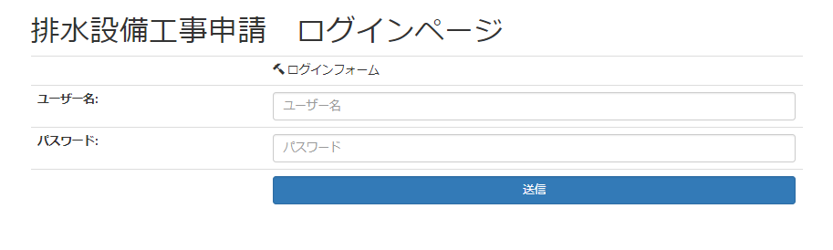
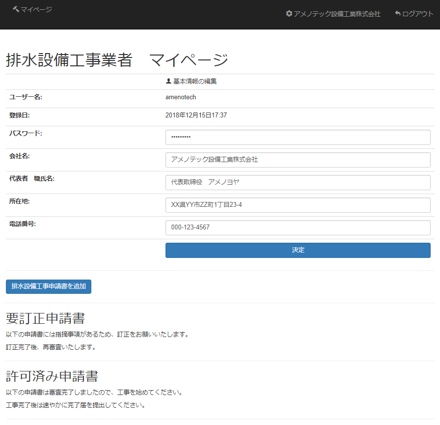
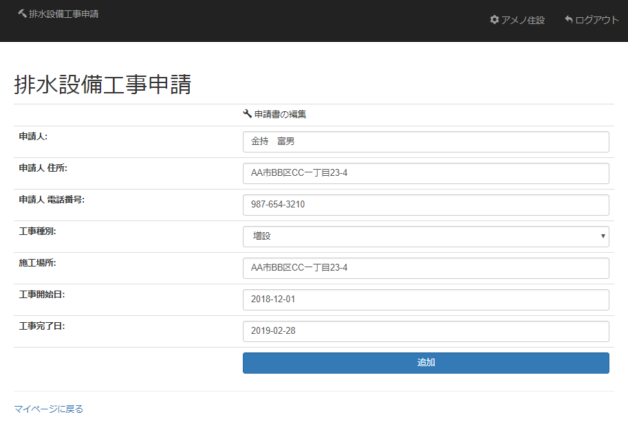
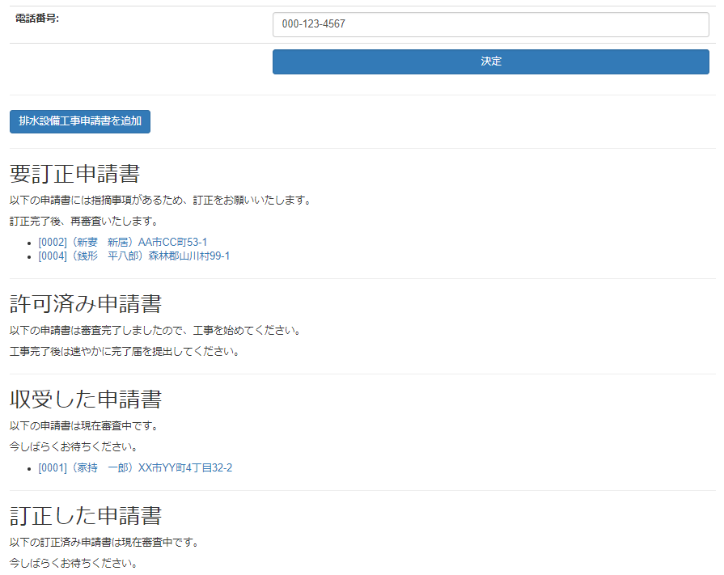
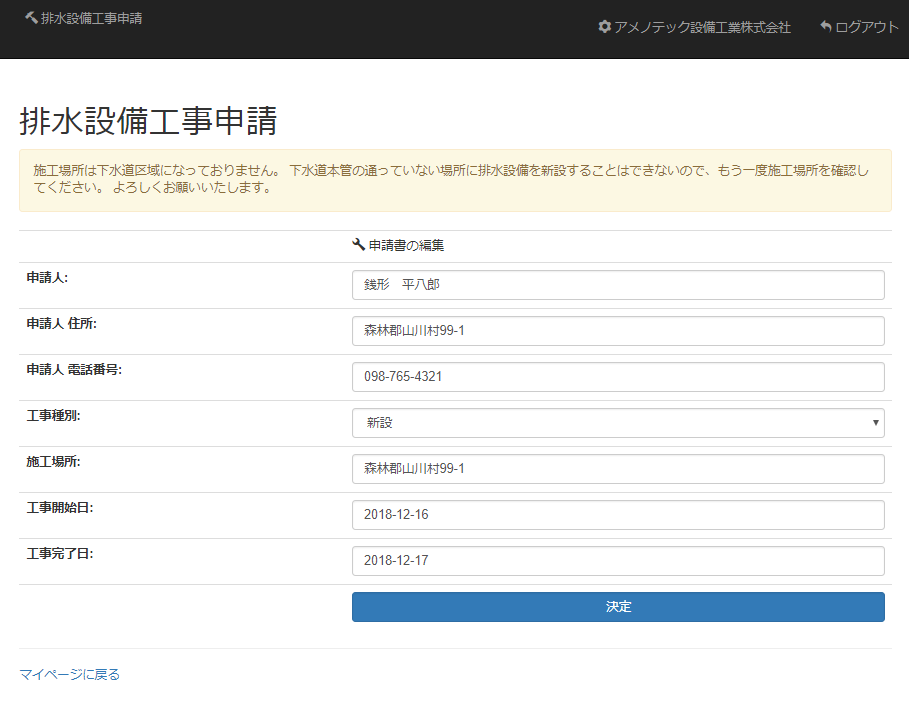

# 排水設備工事・電子申請

## 使用言語
Python 3.5

## フレームワーク
Django 2.2.1

## 概要
下水道（排水設備）の工事に関する申請書の受付等の仕事をしていた時に提案したWebアプリ

紙ベースで提出された申請書を職員が目視で確認していたが、窓口応対や現場対応もあり、確認漏れが起きることが多々あったため、業務の効率向上を目指して電子化を提案した

## 内容紹介
施工業者は基本的にこちら側で登録し、ユーザー名とパスワードを発行する

業者はログイン画面からログインして、各種操作を行う

ログイン後のマイページでは、社名や代表者、所在地などの基本情報の編集と申請書の追加・修正・閲覧を行うことができる

「排水設備工事申請書の追加」を押すと、以下のように申請書のフォームが現れるため、申請人や施工場所などの情報を入力する

提出された申請書は職員が審査し、指摘事項等がある場合は「要訂正申請書」の欄に移動する

要訂正申請書に掲載された申請書のリンクをクリックすると、申請書訂正フォームに移り、そこで指摘事項等を確認することができる

最終的に審査が完了した申請書は「許可済み申請書」のリストに掲載されるため、業者はそれを確認して工事を行うことができる

なお、当然ではあるが、自分が申請した申請書以外の情報は見ることができないようになっている